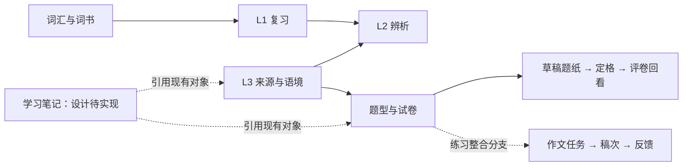

# 已有功能与实现位置

基准：本地主线 `ccc6fb4`，分支增量明确标出。核验方法为路由/组件/service/脚本与既有验收记录比对；本轮没有重新逐页浏览器验收。下列路径均相对于仓库根目录。

收尾轮（2026-09-19）：已完成三个学习数据库的备份与隔离恢复验证、外层资料全量保全与文档收敛；结果与私密位置索引见 [local-closeout-facts-2026-09-19.md](local-closeout-facts-2026-09-19.md)。

## 用户能力地图

| 能力 | 已有用户路径与行为 | 实现定位 | 状态 / 主要边界 |
|---|---|---|---|
| 首页与统计 | `/`、`/dashboard`：学习入口与进度统计 | `src/frontend/pages/HomePage.tsx`、`DashboardPage.tsx`；`src/services/stats.service.ts` | 主线已有；实际数据依赖 owner 身份和数据库 |
| 词汇与词书 | `/words`、`/words/:slug`、`/plaza`：词详情、词书/集合与内容查看 | `WordsPage.tsx`、`WordDetailPage.tsx`、`PlazaPage.tsx`；`word.service.ts`、`wordbook.service.ts`、`plaza.service.ts` | 主线已有；不能用空库页面评价历史词库是否丢失 |
| 生词捕获与导入 | `/capture`、`/import`：捕获和导入现有词汇材料 | `CapturePage.tsx`、`ImportPage.tsx`；`capture.service.ts`、`vocab-import.service.ts` | 主线已有；原始 MD/语料是独立迁移资产 |
| L1 复习 | `/review`：队列、答题、撤销/暂停等复习流程 | `ReviewPage.tsx`、`components/review/`；`review.service.ts`、`src/fsrs/` | 主线已有；L1/L2 调度隔离，不应在恢复时重置进度 |
| L2 辨析与内容扩展 | `/l2-drill`、词详情扩展、`/upgrade`：辨析训练与升级工单 | `L2DrillPage.tsx`、`UpgradePage.tsx`；`l2-drill.service.ts`、`l2-content.service.ts`、`upgrade-work-order.service.ts` | 主线已有；LLM 可选，未配置时生成接口显式不可用；L3 context adapter 已存在 |
| L3 素材阅读 | `/l3` 素材宇宙、书架、来源阅读与深链定位 | `L3Page.tsx`、`components/l3/L3Bookshelf.tsx`、`L3ReadingView.tsx`；`l3-read.service.ts` | 主线已有；`sourceId/contextId/wordSlug` 深链已经接线 |
| L3 语境共建 | 手动创建、导入提案、确认/拒绝、推荐、图谱 | `L3ManualEditorPage.tsx`、`L3ImportPage.tsx`、`L3ProposalPage.tsx`、`L3RecommendationPage.tsx`、`L3GraphPage.tsx` | 主线已有；自动生成内容遵循各域审核合同，不能扩权直写 |
| 题型与试卷台 | `/l3` 内试卷台、七题型空间、按文件/整卷打开 | `components/l3/L3PapersPage.tsx`、`L3ExamPaper.tsx`；`l3-paper.service.ts`、`l3-practice.service.ts` | 主线已有；内部 section 不全是独立 URL route，入口以 `L3Page` 的参数解析为准 |
| 题纸生命周期 | 草稿、保存、三档定格、导出、历史与按 sheet 回看 | `L3ExamPaper.tsx`；`l3-sheets.service.ts`、`l3-sheet-export.service.ts` | 主线有基础与 F-1 回看；强并发版本保护/脏键/StrictMode/编辑锁在 PR #124，尚未合入本地主线 |
| 题目注记与评卷 | 题目/选项/片段注记、评审、agent 评卷、owner 读面与改判 | `l3-annotations.service.ts`、`l3-grading.service.ts`、`l3-assessments.service.ts`；相关卷面组件 | 主线已有；注记是题目级资产，题纸 verdict 属于特定轮次；“注记评审后续加固”不等于功能完全未开发 |
| 练习、会话与错题 | L3 练习/会话/错题页，消费既有题目和记录 | `L3PracticePage.tsx`、`L3SessionPage.tsx`、`L3ErrorBookPage.tsx`；`l3-session.service.ts` | 主线已有；不自动把练习结果解释成新的 FSRS 轨 |
| 作文空间 v1 | 任务、稿次、自动保存、提交、反馈、对照与导出 | `L3WritingPage.tsx`、`components/writing/`；`l3-writing-*.service.ts`；`state/writingSaveController.ts` | PR #122 已合入；恢复期间续写误确认修复在 PR #124 |
| 作文与原题整合 | 原题进入专项作文、按题进度、来源条、保存后跳转、返回原纸定位 | `writing-practice-v1` 的 `WritingQuestionEntry`、origin/resume 导航与 `e2e/writing-origin.spec.ts` | 分支已实现并有验收记录；与 #124 共改题纸/保存/导航，整合前需比对，不能把两个分支都绿推导为组合后绿 |
| 现有“笔记” | `/notes` 词汇笔记/标注；来源阅读侧栏笔记 | `NotesPage.tsx`、`note-entry.service.ts`、`L3SourceNotesDrawer.tsx` | 主线已有；不是用户提出的“每题型自由笔记＋专题＋深度引用”系统 |
| 题型学习笔记 | 已形成 N1/N2/N3 设计；N1 引用题目/来源/片段 | `docs/plan/study-notes-design-2026-09-18.md` 及配套执行计划/提示词 | 设计待实现；勿重复建立作文正文或作答真源 |
| 完整翻译作答 | 题目/参考材料可消费 | 旧主观题表面、Task C 需求 | 不宣称已支持全文译文可靠保存；Task C 需诚实降级或接真实入口 |

## 数据与架构的稳定边界

- HTTP → service → repository → PostgreSQL 是写入分层；事务、RLS、owner/agent 权限均是功能合同的一部分。
- L1/L2 有独立调度与内容 hash；L3 为知识层，不能通过新笔记需求引入第三条 FSRS 调度。
- 普通题纸按题答案与作文全文版本保存是不同协议；既有可靠性控制器可参考，不把对象强行混装。
- 学习笔记优先引用既有对象，N1 不复制题库、不创建另一份作文历史；历史稿次/评卷等引用按 N2 另行设计。

## 工程底座：已有实现不等于当前已启用

| 能力 | 代码/合同 | 换机时的动作 |
|---|---|---|
| API 与权限 | `docs/api/openapi.json`、`src/http/`、`src/config/agent-tokens.ts` | 重建 owner/agent 配置，校验权限，不能把测试 token 用到私人数据服务 |
| 迁移与角色 | `drizzle-release/`、`scripts/bootstrap-database-roles.ts` | 保留迁移 journal；prepare → migrate → converge，业务恢复使用同一版本先验收 |
| 备份/恢复/调度 | `postgres-backup.ts`、`run-backup-scheduler.ts`、Compose `backup-scheduler` | 工具已存在；确认新机实际调度、签名密钥、目录权限和最近成功备份，不能重复派“从零开发调度” |
| outbox 与 worker | `run-review-outbox-worker.ts`、`run-llm-reservation-reaper.ts` | 前台能打开不代表后台已启动，核对 worker 独立进程/容器 |
| 本地/部署 | `compose.yaml`、`compose.single-host.yaml`、Cloudflare 覆盖层 | 选择一条运行方式；不要混合本地开发 Compose 与单机生产清单 |
| 工程门禁 | `package.json`、`.github/workflows/ci.yml`、`writing-e2e.yml` | 绑定实际 head 和有效 base；真实 PG/E2E 不能在个人 dev 库执行 |

## 最值得先做的事情

1. 保全未合并分支、未提交设计与数据库；先能恢复再开发。
2. 核验并整合可靠性补修，随后核对作文练习分支，关闭 Task C 的真实缺口。
3. 在稳定基线上推进轻量学习笔记 N1；复用保存/版本/引用导航经验，先保证自由笔记可用。
4. 分页、注记并发、跨纸展示语义、备份实际运行和 Git 根因分别建有证据的任务；不扩大本轮迁移范围。
