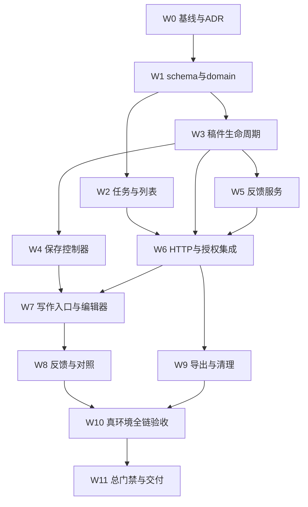

# 作文子空间 Implementation Plan

> **For agentic workers:** REQUIRED SUB-SKILL: Use `subagent-driven-development` when the dispatch owner authorizes parallel implementation, or `executing-plans` for sequential execution. Follow the checkboxes below task-by-task. 本次文档交付不启动子代理、不修改业务代码。

**Goal:** 实现作文任务的可靠写作、按稿反馈、第二稿与历史回看，交付可在真实浏览器闭环使用的 v1。

**Architecture:** 新增 writing task 与 feedback 两张表，submissions 扩展 writing scope，attempts 继续承载提交后的唯一正文。专用 HTTP 写面负责版本锁与权限，独立写作组件复用 UI/认证基础。

**Tech Stack:** TypeScript、Hono、Drizzle、PostgreSQL 17、Zod 4、React 19、Vite、Vitest、Playwright。Node 22.22.2/npm 10.9.x（以执行时 package engines 和 .nvmrc 为准）；无新增运行时依赖。

**设计真源:** `docs/plan/writing-space-design-2026-09-18.md`，简称 S；任务中的 S§n 均引用其章节。

## 全局执行约束

1. 这是完整 v1 的范围承诺；代码片段为必须满足的契约和测试关键断言，不是允许跳过实现的伪完成产物。W0 之后先冻结 domain/DTO，再交接并行任务。
2. 当前接入基线 main@f03ffe3；PR #121及0037已经合入。三份作文计划尚未入库，先点名提交文档再建worktree；study-notes等其他未提交文件不得夹带。执行方以隔离worktree从已确认集成基线开始；不复制未提交修改、不清理临时文件，不在共享wt-main直接多人写。
3. 文案中文、已有token，无自动评分/全文代写/离线存储/FSRS写入。页面最多一个写作PATCH在途。GET零创建。
4. 事务为task→sheet固定锁序；状态/归属/版本检查在持锁事务内；不得调用另开事务的public service组成“伪原子”流程。
5. 新路由直挂 `src/http/server.ts`，不扩写受棘轮约束的旧组合器；新增路由复杂度基线、operations注册、auth矩阵、OpenAPI/client同步。
6. 新表RLS与复合owner FK；迁移、Drizzle schema、journal/snapshot、角色converge/verifier、迁移数量断言一起更新。迁移号由W1在集成基线分配，不预占0038。
7. 不把Accepted ADR当已实现。旧任务表“每次再生都重钉breaking approval”已被ADR-0035勘误取代；仅实际修改approval时按真实base/head重锚，不为通过检查随意改豁免。
8. 按基线真实diff执行coverage/API/complexity门禁；不能指向HEAD或无差异base绕过棘轮。内存不足串行低并发，失败标阻塞，不宣称通过。
9. 每任务按“失败测试→实现→定向测试→review→提交”执行。仅提交任务文件，不 `git add .`；提交/PR由外派执行授权范围决定，不自动merge/deploy。
10. 本计划使用 `docs/plan/`，遵循仓内计划权威目录约定。迁移与ADR并行编号冲突由集成负责人解决，不能通过改写历史迁移逃避。

## 任务图、派工与独占文件



最多三条开发支线：后端数据、前端状态/界面、反馈/导出。W1合并后W2/W3可并行；W3接口冻结后W4/W5可并行。W6是集成闸口。为赶进度同时改schema或operations不被允许。

独占矩阵：

| 文件/产物 | 唯一写者 |
|---|---|
| schema、迁移SQL/journal/snapshot、数据库角色清单 | W1集成负责人 |
| domain/l3-writing.ts、DTO、schemas/http/service导出 | W1先冻结，W6统一集成后续变更 |
| repositories/interfaces.ts、factory.ts、services/index.ts | W6集成负责人；早期任务交付独立类与精确注册差异说明 |
| http/server.ts、operations.ts、生成OpenAPI/client | W6集成负责人 |
| L3Page、shell导航、试卷入口、HomePage | W7负责人 |
| 写作页面及新组件 | W7；W8仅触feedback/compare独立组件及已约定插槽 |
| e2e夹具与综合报告 | W10负责人 |

任务各自能在注入依赖的定向测试中验证，不以“等待全局注册”为理由绕过测试。必须改独占文件时先交由指定写者串行处理。

## W0 · 基线、共享依赖与ADR（S§0–1）

**Files**：创建 `docs/adr/writing-workspace.md`；更新 `docs/plan/README.md`、`docs/design/l3-space/baseline.md`；创建 `docs/plan/writing-space-execution-log-2026-09-18.md`。

**输入**：本计划、S、ADR-0023/0029/0030/0034/0035及F-1最新实现。**输出**：baseline SHA、真实检查base SHA、ADR、接口冲突清单、执行日志。

- [ ] 读本目录AGENTS（若存在），`git status --short`、`git log -5`、`git worktree list`，确认当前分支、未提交变更及F-1合入状态；不读取/打印.env值。
- [ ] 先点名提交三份writing-space计划、确认它们在Git中可读，再使用 `using-git-worktrees` 建隔离checkout。记录实际绝对路径；所有后续命令workdir指向它，不用 `npm --prefix` 假装切换cwd。
- [ ] 确认包含f03ffe3，0037已入迁移链；点名提交三份作文计划（README若有他人条目用精确hunk暂存），使隔离worktree确实可读。复用F-1读面/交互语义；保存控制器未因F-1验收自动获证，继续W3/W4故障测试。
- [ ] 创建ADR，钉死writing scope、正文真源、反馈唯一性、提交即限定授权、GET只读、任务归档和删除策略。新增W1–W5体验锚点（S§8），关联本计划。
- [ ] 记录环境：Node/npm、PG与前后端地址、测试库名（不含凭据）。不会改变dev真实数据；使用独立验收fixture/数据库。
- [ ] 文档review后提交：`docs: define writing workspace contracts`。

**阻断条件**：基线不可确定、共享迁移尚未形成稳定schema、发现与已有已批准ADR本质冲突。只有受影响任务暂停；继续独立UI契约/纯函数准备。不能自行覆盖别人工作。

## W1 · Domain、DTO与数据库增量（S§3、5–6）

**Create**：`src/domain/l3-writing.ts`、`src/repositories/l3-writing.types.ts`、`tests/domain/l3-writing.test.ts`、`tests/writing-rls.integration.test.ts`。
**Modify**：`src/domain/l3-sheets.ts`、`src/domain/index.ts`、`src/db/schema.ts`、`src/db/relations.ts`、`src/db/types.ts`；实际生成的新 `drizzle-release/*.sql`及meta；`scripts/bootstrap-database-roles.ts`、`scripts/verify-database-roles.ts`、`scripts/verify-release-database.ts`及相关测试。

**输出合同**：以下类型在 `src/domain/l3-writing.ts` 单一导出，其他任务禁止自建同名漂移类型。

```ts
export type WritingKind = 'whole' | 'paragraph' | 'free';
export type WritingDirection = '通用' | '考研' | '雅思';
export type WritingSeed = 'blank' | 'copy';
export type WritingContentStatus = 'available' | 'cleared';
export type WritingSheetStatus = 'draft' | 'sealed' | 'discarded';
export interface WritingTaskDto {
  id: string; questionId: string; title: string; prompt: string;
  kind: WritingKind; direction: WritingDirection;
  status: 'active' | 'archived'; createdAt: string; updatedAt: string;
}
export interface WritingSheetDto {
  id: string; taskId: string; status: WritingSheetStatus;
  draftVersion: number; revisionNo: number | null;
  parentSheetId: string | null; createdAt: string;
  updatedAt: string; sealedAt: string | null;
}
export interface WritingFeedbackRecord {
  feedback: WritingFeedback; version: number; textSha256: string;
  lastEditor: string; updatedAt: string;
}
export interface WritingSheetDetail {
  sheet: WritingSheetDto; text: string | null; textSha256: string | null;
  wordCount: number; contentStatus: WritingContentStatus;
  feedback: WritingFeedbackRecord | null;
}
export interface WritingPage<T> {
  items: T[]; total: number; nextCursor: string | null;
}
export interface CreateWritingTaskResult {
  task: WritingTaskDto; draft: WritingSheetDto|null; created: boolean;
}
export interface WritingTaskSummary {
  task: Omit<WritingTaskDto,'prompt'>;
  draftSheetId: string|null; lastSheetId: string|null;
  latestRevisionNo: number|null;
}
export interface WritingRevisionSummary {
  sheet: WritingSheetDto; contentStatus: WritingContentStatus;
  feedbackState: 'pending'|'ready'|'unavailable';
}
export interface WritingTaskDetail {
  task: WritingTaskDto; draftSummary: WritingSheetDto|null;
  revisionCount: number; latestSubmittedSheetId: string|null;
}
```

`WritingFeedback` 按S§5逐字段实现，不改名；Zod strict，max/nullable形状固定。`text`保存schema与旧choice schema分离，定义 `writingDraftInputSchema={expectedVersion:nonnegative int,text:string.max(20000)}`，不借 `.partial()` 引入默认值。`normalizeWritingText`、`countEnglishWords`、`validateFeedbackAnchors` 为纯函数；hash放service/util（domain零出向）。

- [ ] 写失败测试：CRLF归一但保留空格；空稿可保存但提交拒绝；20001字符拒绝；相同priority id拒绝；中文/emoji的UTF-16锚点精确匹配。

```ts
it('保留正文而只归一换行', () => {
  expect(normalizeWritingText('  A\r\nB\r')).toBe('  A\nB\n');
});
it('锚点按UTF16匹配原文', () => {
  expect(validateFeedbackAnchors('A😀B', [{start:1,end:3,quote:'😀'}])).toEqual([]);
  expect(validateFeedbackAnchors('A😀B', [{start:1,end:2,quote:'😀'}])).not.toEqual([]);
});
```

- [ ] `npx vitest run tests/domain/l3-writing.test.ts --coverage.enabled=false --maxWorkers=1`：先确认有意义失败，再实现纯函数与schema使其通过。
- [ ] 依据S§3落两表/四列/外键/索引/CHECK；扩展attempt venue与sheet响应scope，不扩展旧open输入为“可随意写writing”。特殊sheet写面必须由W3管理。
- [ ] 运行`npm run db:generate`生成迁移。核对id/prevId链与实际迁移序号；已有快照不随意重写。按现有角色模板加新表授权，converge及verifier保持一致。
- [ ] RLS测试先证明owner A不能读写B；伪造question/task/sheet关系失败；单task双draft违反索引；writing sheet重复attempt被DB拒绝；现有file/paper插入仍合法。
- [ ] `npm run db:schema:drift`以及配置了独立数据库的 `npx vitest run --config vitest.integration.config.ts tests/writing-rls.integration.test.ts` 通过。缺真实DB不得以mock替代验收。
- [ ] 提交：`feat(db): add writing task and feedback contracts`。

## W2 · 写作任务、查找、分页与归档（S§2、3 D1）

**Create**：`src/repositories/l3-writing.repository.ts`、`src/services/l3-writing-task.service.ts`、`tests/repositories/l3-writing.test.ts`、`tests/services/l3-writing-task.test.ts`。
**Modify**：`src/services/l3-paper.service.ts`和`src/repositories/l3-paper.repository.ts`仅加引用删除blocker与内部题过滤；全局注册交给W6。

**接口**：`WritingTaskService.create(userId,input):Promise<CreateWritingTaskResult>`；`get(userId,taskId):Promise<WritingTaskDetail>`；`list(userId,{q,status,limit,cursor}):Promise<WritingPage<WritingTaskSummary>>`；`rename`、`archive`、`restore`。repo暴露 `lockTask(userId,taskId,tx)`供W3/W5/W9统一锁序。

创建输入采用S§6，requestId严格UUID；prompt与questionId互斥；kind/direction必填，frontend负责默认值。同requestId不同规范化输入409 `IDEMPOTENCY_CONFLICT`，用W1的create_input_hash判断，不使用可改title作唯一比对依据。并发重试冲突必须整体回滚本次多建的question，不能留下孤立内部题。

- [ ] 写测试，注入事务/repo：相同requestId重试返回同task与首稿；forceNew=false同题复用；forceNew=true新建但请求重试不重复；题型非essay422；另一owner404。

```ts
const first = await service.create(ownerA, input);
const replay = await service.create(ownerA, input);
expect(replay.task.id).toBe(first.task.id);
expect(replay.draft?.id).toBe(first.draft?.id);
expect(replay.created).toBe(false);
await expect(service.get(ownerB, first.task.id)).rejects.toMatchObject({statusCode:404});
```

测试异常断言按项目现有AppError字段改写为实际matcher，不自行创造新异常类型。
- [ ] 先运行对应repository/service测试看到失败；实现同事务创建question/task/draft，复用S§4的task→sheet锁顺序。若复用任务已无draft，create响应draft=null，禁止偷偷新建；W1/W6/W7都使用同一CreateWritingTaskResult。
- [ ] 实现列表keyset、搜索转义、稳定排序、limit20/50、summary无正文；任务updated_at在保存/提交/反馈变化后更新，排序行为明确。
- [ ] 归档有draft409，归档后的读取和导出仍可用；恢复不自动开纸。内部题不会污染普通题型列表，既有essay题仍可见。
- [ ] 跑25条任务分页测试：逐页无重复/漏项；输入中 `% _` 不变通配；只搜当前owner。
- [ ] 提交：`feat(writing): add task lifecycle and discovery`。

## W3 · 版本保存、提交、修改稿与只读历史（S§3 D2、4）

**Create**：`src/services/l3-writing-sheet.service.ts`、`src/services/l3-writing-text.ts`、`tests/services/l3-writing-sheet.test.ts`、`tests/writing-concurrency.integration.test.ts`。
**Modify**：W2 repo、`src/services/l3-sheet-scope.ts`、`src/services/l3-sheets.service.ts`、`src/repositories/l3-sheets.repository.ts`；新repo方法由单一backend写者串行合入。

**接口**：`getSheet(userId,taskId,sheetId):Promise<WritingSheetDetail>`；`saveDraft(userId,taskId,sheetId,{expectedVersion,text})`返回sheet/hash；`submit`返回sheet/attemptId；`createDraft(...,{parentSheetId,seed})`返回sheet/created；`discard`；`listRevisions`返回WritingPage稿摘要。`sha256WritingText(text)`实现node:crypto hash，domain不引node。

- [ ] 测试“旧version不覆盖新正文”“两个submit只有一个attempt”“GET已提交稿零INSERT”“第二稿不改第一稿”。

```ts
const saved = await api.saveDraft(user, taskId, draftId, {expectedVersion:0,text:'First\nDraft'});
await expect(api.saveDraft(user,taskId,draftId,{expectedVersion:0,text:'old'})).rejects.toBeDefined();
const a = await api.submit(user,taskId,draftId,{expectedVersion:saved.sheet.draftVersion});
const b = await api.submit(user,taskId,draftId,{expectedVersion:saved.sheet.draftVersion});
expect(b.attemptId).toBe(a.attemptId);
expect((await api.getSheet(user,taskId,draftId)).text).toBe('First\nDraft');
```

- [ ] 定向测试先红；实现事务内锁与CAS。SQL核心谓词如下，服务层错误映射在持锁时区分404/409：

```sql
SELECT * FROM l3_writing_tasks WHERE id=$1 AND user_id=$2 FOR UPDATE;
SELECT * FROM l3_submissions WHERE id=$3 AND user_id=$2 AND writing_task_id=$1 FOR UPDATE;
UPDATE l3_submissions SET answers=$4::jsonb, draft_version=draft_version+1, updated_at=now()
WHERE id=$3 AND user_id=$2 AND status='draft' AND draft_version=$5 RETURNING *;
```

- [ ] submit只用持锁后最新answers，写attempt后同事务sealed并清空answers；task锁下分配revision_no。实现重放sealed响应；discarded拒绝。revision_no不以count充当max。
- [ ] createDraft parent归属/状态检查；同parent复用已有draft，不同parent409；copy只读active attempt。修改稿提交仍写同一task.questionId，不制造新题。
- [ ] 更新通用scope resolver以返回task.question；通用open保持file/paper输入；通用patch/seal及导出、grading入口对writing按S约束拦截/路由，不允许只在UI隐藏。
- [ ] 真实PG两连接可控屏障测试：save与submit交错，最终只允许“新正文提交”或“旧版本冲突后未提交”；禁止旧正文成功定格而保存B也成功却丢失。不同owner隔离、相同task两createDraft也跑。
- [ ] 提交：`feat(writing): persist drafts and immutable submitted revisions`。

## W4 · 可复用的可靠保存控制器（S§4）

**Create**：`src/frontend/state/writingSaveController.ts`、`src/frontend/hooks/useWritingDraft.ts`、`tests/frontend/writing-save-controller.test.ts`。

**接口**：

```ts
type SaveState = 'clean'|'dirty'|'saving'|'retrying'|'error'|'conflict';
interface WritingSaveController {
  setText(text:string):void;
  setComposing(value:boolean):void;
  flush():Promise<void>;
  retry():Promise<void>;
  getSnapshot():{text:string;version:number;state:SaveState;inFlight:boolean};
  subscribe(listener:()=>void):()=>void;
  dispose():void;
}
```

构造工厂 `createWritingSaveController({text,version,save,load,setTimer,clearTimer})`；save返回 `{draftVersion,textSha256}`，load返回当前text/version。同步getSnapshot始终反映最新本地文本。dispose清理timer/listener但不伪造保存成功；已在途response不能更新卸载组件。

- [ ] 用deferred Promise写如下真实状态测试，不以snapshot模拟实现：

```ts
controller.setText('A');
const first = controller.flush();
controller.setText('AB');
const second = controller.flush();
expect(save).toHaveBeenCalledTimes(1);
resolveFirst({draftVersion:1,textSha256:hashA});
await nextMicrotask();
expect(save).toHaveBeenCalledTimes(2);
expect(controller.getSnapshot().text).toBe('AB');
resolveSecond({draftVersion:2,textSha256:hashAB});
await Promise.all([first,second]);
expect(controller.getSnapshot().state).toBe('clean');
```

deferred辅助与hash由测试本身构造；补网络失败flush reject、旧响应不覆盖新输入、409不重试、IME不半截保存、3次退避及dispose测试。
- [ ] 实现单在途请求、输入seq/已确认seq、flush waiter、1/2/4秒网络重试；response/version只对应已发送快照；超时load恢复按S§4。
- [ ] hook处理composition、导航保护和beforeunload，清除所有监听器；无localStorage/IndexedDB。提交锁编辑由W7 UI持有，不藏在控制器。
- [ ] `npx vitest run tests/frontend/writing-save-controller.test.ts --coverage.enabled=false --maxWorkers=1`通过。
- [ ] 提交：`feat(writing): serialize autosave and protect unsaved drafts`。

## W5 · 定位反馈与agent边界（S§5）

**Create**：`src/repositories/l3-writing-feedback.repository.ts`、`src/services/l3-writing-feedback.service.ts`、`tests/services/l3-writing-feedback.test.ts`、`tests/repositories/l3-writing-feedback.test.ts`。
**Modify**：通用 `src/services/l3-grading.service.ts` writing guard（与W3约定唯一写者）。

**接口**：`getContext(userId,taskId,sheetId)`；`getFeedback(...):{state,feedback}`；`putFeedback(userId,taskId,sheetId,{expectedVersion,textSha256,requestId,feedback},editor)`。editor由HTTP principal注入，service不能从body读。

- [ ] 先写失败测试：draft409、跨owner404、正文清理409、错误hash422、错quote422、超出段尾422；重复request同body不升version；相同request不同body409；两writer相同expectedVersion只有一个成功。

```ts
await expect(service.putFeedback(user,taskId,sheetId,{
  expectedVersion:0,requestId,textSha256:'0'.repeat(64),feedback
},'agent:reviewer')).rejects.toBeDefined();
expect(repo.upsert).not.toHaveBeenCalled();
```

- [ ] 实现task→sheet→feedback锁序；不存在feedback的首写由sheet锁串行保护。validated feedback总JSON字节≤64KiB。priority id去重，anchor逐字校验。hash指向exact稿正文。
- [ ] context只含指定sealed稿，无题库答案/其他草稿/跨稿内容；普通agent list任务与写正文不允许。
- [ ] generic grading对于writing409；现有普通essay grading回归通过。
- [ ] 提交：`feat(writing): add revision-bound agent feedback`。

## W6 · API、授权、注册与生成物（S§6）

**Create**：`src/http/routes/l3/writing-tasks.ts`、`writing-sheets.ts`、`writing-feedback.ts`；`src/http/l3-writing-response-contract.ts`；`src/frontend/api/writingClient.ts`；`tests/http/l3-writing.test.ts`、`tests/http/l3-writing-response-contract.test.ts`。
**Modify**：`src/repositories/interfaces.ts`、`factory.ts`、`src/services/index.ts`、`src/schemas/http/index.ts`、`src/schemas/service/index.ts`（先确认实际路径）、`src/http/server.ts`、`src/http/operations.ts`、`src/errors/codes.ts`、`scripts/verify-route-complexity.ts`、`tests/http/authorization-registry.test.ts`、授权矩阵及生成物。

**输入**：W1–W5实际类与签名。**输出**：S§6完整API，writingClient逐个端点类型化函数；客户端错误沿用BrowserApiError，不吞非法响应为成功空值。

- [ ] HTTP测试先红：无认证401，agent保存/提交403，owner cookie写无CSRF403，agent context/feedback允许；未知字段400，错误归属404；GET任务/稿/反馈多次调用没有INSERT。
- [ ] 按S§6逐端点实现薄路由，分文件使复杂度在基线内。输入严格校验，输出zod验证。通用response scope新增writing时更新union，但不让旧open schema自动接受writing。
- [ ] 注册repo/service一次完成；禁止各子任务分别再生client。body上限覆盖Hono读取前或统一middleware，不能只在完整parse后才防超大请求。
- [ ] OpenAPI、generated client、breaking比较使用真实base；writingClient网络client复用browserRequest，不新建认证方式。
- [ ] `npm run typecheck`、`npm run arch:check`、`npm run api:governance`、`npm run complexity:routes`及定向HTTP测试通过。
- [ ] 提交：`feat(api): expose writing workflow with scoped authorization`。

## W7 · 作文入口、任务列表与编辑器（S§2、8）

**Create**：`src/frontend/pages/L3WritingPage.tsx`；`src/frontend/components/writing/WritingTaskList.tsx`、`WritingStartDialog.tsx`、`WritingEditor.tsx`、`WritingRevisionList.tsx`；`src/frontend/viewModels/writingNavigation.ts`；`tests/frontend/writing-workspace.test.tsx`。
**Modify**：`src/frontend/pages/L3Page.tsx`、`src/frontend/viewModels/l3ShellViewModel.ts`、`src/frontend/components/l3/L3PapersPage.tsx`、`src/frontend/pages/HomePage.tsx`；不把正文编辑逻辑加入L3ExamPaper。

**接口**：L3WritingPage从searchParams读取task/sheet/compare；API服务来自writingClient；保存来自useWritingDraft；W8插槽用 `{task:WritingTaskDto,detail:WritingSheetDetail,onRefresh:()=>Promise<void>}`。

- [ ] 先写UI测试：空态开始→焦点在textarea；选择题继承题面；输入→保存状态变化；GET深链已提交稿不调用创建；无草稿时不自动建纸；401/409/422文案分开。
- [ ] 实现任务列表20条分页、标题搜索、最近草稿；正常起笔≤2次主要点击；创建requestId在结果未知时沿用，成功/取消后新建意图换UUID。
- [ ] textarea同步本地文本， composition正确；显示字数估算与字符数，手机页签切换不丢内容。失败提供复制与重试。
- [ ] submit先锁编辑→await flush→读最新version→POST submit→replace URL为明确sheetId。任一步失败不宣称已提交，不清空正文。成功后只读。
- [ ] 按S§2/§10统一使用sheet查询参数；section=writing优先路由，纯?sheet的writing读元数据后replace到作文规范URL，错误/非属主不创建；旧档案显式过滤file/paper。深链参数修改受未保存导航保护；返回列表也检查dirty。浏览器F5加载同sheetId，无新draft。列表“开始修改”是显式POST。
- [ ] 集成W8反馈/compare占位必须是清楚的loading/error状态；任务合并时不留下假数据成功UI。
- [ ] `npx vitest run tests/frontend/writing-workspace.test.tsx --coverage.enabled=false --maxWorkers=1`与`npm run frontend:build`通过，截图W1/W2/W4。
- [ ] 提交：`feat(frontend): add low-friction writing workspace`。

## W8 · 反馈、第二稿与对照（S§2、5）

**Create**：`src/frontend/components/writing/WritingFeedbackPanel.tsx`、`WritingComparison.tsx`、`WritingReviewInstruction.tsx`；`tests/frontend/writing-feedback.test.tsx`、`tests/frontend/writing-comparison.test.tsx`。
**Modify**：L3WritingPage仅接已约定插槽，由W7负责人集成。

- [ ] 测试无反馈≠加载失败；优先项0条合法；HTML作为文本；点击建议准确定位emoji后的原句；API hash不一致不得把旧反馈覆盖到当前稿。
- [ ] 添加“复制本地评阅指令”和“刷新反馈”。复制文案中明确本地HTTP工具路径、taskId/sheetId、反馈schema；不拷贝token，不写“导出给外部AI后自动回灌”。不创建后台job、不模拟processing状态。
- [ ] 主按钮“开始修改”默认copy当前sealed稿；已有相同parent草稿返回继续；不同parent409解释并给前往现有草稿，不自动discard。
- [ ] 对照选择任意两个sealed稿；显示稿次/日期/来源稿，独立反馈；草稿不进入已提交对照列表。未评过的一稿显示尚无反馈，不借用另一稿。
- [ ] 手机上下对照或页签，桌面双栏；复制与选中文本不被强制跳转劫持。每个建议有可键盘操作的跳转按钮。
- [ ] 定向组件测试、frontend build、明暗/手机截图W3/W5通过。
- [ ] 提交：`feat(frontend): connect writing feedback and revision comparison`。

## W9 · 导出、清理与跨入口兼容（S§7）

**Create**：`src/services/l3-writing-export.service.ts`、`src/http/routes/l3/writing-export.ts`、`tests/services/l3-writing-export.test.ts`。
**Modify**：`src/services/l3-sheets.service.ts` 删除attempt流程、相关repo、operations（交W6写者）、writingClient、WritingEditor导出动作。

**接口**：`exportSheet(userId,taskId,sheetId):Promise<{markdown:string,sha256:string,filename:string}>`；JSON块包含`exportSchemaVersion:1,kind:'writing_sheet',task,sheet,text,textSha256,feedback`。content hash规则在文件header说明，继承现有题纸导出“移除校验行重算”方案，不递归hash自身。

- [ ] 测试草稿导出准确版本；sealed从attempt读；含反引号/中文/emoji仍可提取JSON并校验hash；正文清理409且无quote；归档任务可导出。
- [ ] 前端导出先flush再GET；错误时不生成空文件、假成功toast。安全filename，Content-Disposition及Content-Type正确。
- [ ] soft-delete writing attempt按task→sheet锁序执行，清理feedback；若并发feedback写入，最终不得留下deleted正文的quote。普通attempt删除回归保持。
- [ ] 通用sheet export若遇writing明确409并指向专用入口，不输出遗漏writing元数据的旧v2产物；generic grading、annotations操作不得改作文正文或创建第二套反馈。
- [ ] 已有file/paper/RLS/OpenAPI契约回归；新增并发删除/feedback用真实PG测试。
- [ ] 提交：`feat(writing): export revisions and honor content cleanup`。

## W10 · 真实浏览器＋数据库闭环（全S）

**Create**：`e2e/writing.spec.ts`、`e2e/writing-faults.spec.ts`；`docs/plan/writing-space-acceptance-report-2026-09-18.md`。
**Fixture**：独立验收owner，写作相关数据加固定前缀；通过合法API创建。另一个owner用于RLS隔离验证；不能使用真实学习记录做删除/冲突试验。

代理评阅在测试中使用确定性HTTP payload（不是花钱调用LLM）；真实页面和真实API/DB不mock成功。网络故障测试可用Playwright route延迟/abort **实际PATCH**，禁止拦截并直接返回假保存成功。

- [ ] 主线：开始自由写作→输入三段→等已保存→离开→继续→提交→复制指令→agent context读取→PUT feedback→页面刷新反馈→原句定位→新建第二稿→修改→提交→对照→关闭页面→URL重开第一稿→F5仍同sheet。
- [ ] 库核：一个task、一question、两sealed sheets、两attempts；两稿answers均为空；反馈绑定第一稿；第二稿不借用第一稿反馈；页面reload不增加行数。
- [ ] 故障：保存失败阻止submit/export；PATCH在途时再输入不丢；submit重试不重物化；双标签页冲突不覆盖；清理正文后反馈/导出不泄漏；agent不能读draft。
- [ ] 25任务/25稿分页、题库起步、段落模式、归档恢复、手机390×844/桌面1440×900、明暗、IME输入。
- [ ] 采集S§8十类截图、逐步操作日志、network错误、pageErrors、DB核对SQL结果（只留fixtureID与计数，不输出凭据）。截图文件放仓外deliverables，报告记录相对位置。
- [ ] 示例E2E关键断言（按最终中文accessible names实现）：

```ts
await page.goto(savedRevisionUrl);
await expect(page.getByRole('textbox', {name:'作文正文'})).toHaveValue(firstRevisionText);
await expect(page.getByRole('textbox', {name:'作文正文'})).toHaveAttribute('readonly','');
await page.reload();
await expect(page).toHaveURL(savedRevisionUrl);
await expect(page.getByText('第 1 稿', {exact:true})).toBeVisible();
expect(await fixture.countWritingSheets(taskId)).toBe(beforeReloadCount);
```

- [ ] `npx playwright test e2e/writing.spec.ts e2e/writing-faults.spec.ts --workers=1`通过；测试环境缺失要记录阻塞，不能用组件mock换取PASS。
- [ ] 提交：`test(e2e): verify writing revision and feedback lifecycle`。

## W11 · 完整门禁与交付

**Files**：更新本计划checkbox、执行日志、验收报告、README；如需要修复回到对应任务，不把失败删掉。

- [ ] 按最终实际PR基线设置三个环境变量（值须是已验证的祖先SHA）：

```powershell
$writingBase = git merge-base HEAD main
if ($LASTEXITCODE -ne 0) { throw 'Cannot resolve review base' }
if ($writingBase -eq (git rev-parse HEAD)) { throw 'Base equals HEAD; resolve the actual integration base' }
$env:COVERAGE_BASE_REF = $writingBase
$env:API_CONTRACT_BASE_REF = $writingBase
$env:ROUTE_COMPLEXITY_BASE_REF = $writingBase
npm run verify:engineering
```

若main已移动导致该base不对应PR，改为已核对的PR base SHA；不能机械使用脚本结果。运行前确认本机Node/npm符合要求。Windows内存不足时先串行定向检查，在资源足够环境完成正式全量门禁。
- [ ] 跑仓库要求的`npm run verify:db`、相关RLS验收和上节E2E；仅用独立验收库，检查脚本会否变更数据，不能指向真实dev库。
- [ ] 检查生成OpenAPI/client幂等、迁移快照唯一、角色权限真实验证；record所有exit code与日志位置，不引用旧coverage当本次结果。
- [ ] 自审：S§1–9都有任务/验收覆盖；无未实现按钮、dead sealed分支、静默错误冒充空态、分页截断、双全文真源、generic写接口旁路。
- [ ] PR描述写清用户触发与前后行为、迁移兼容、已跑验证、未跑限制、截图。创建PR后调用Codex artifact attach；未得到合并授权不执行merge/deploy。
- [ ] 最终报告列commit/PR、变更范围、基线与schema版本、截图路径、真实DB结果、遗留项。完成标准是W0–W11全部证据满足，而非“组件测试全绿”。

## 最终接口检查项

W1导出的CreateWritingTaskResult允许draft=null，W2/W6/W7不得另造永远有draft的类型；WritingPage与Task/RevisionSummary按W1单一真源导入。

不存在稿件与正文被清理不同：不存在404；cleared详情返回text=null/hash=null/wordCount=0/feedback=null；feedback GET/context/export均409 `WRITING_CONTENT_CLEARED`，不得将其当普通pending。discarded稿text=null，contentStatus=cleared，revisionNo=null，列表显示“已丢弃草稿”。

## 接入阶段里程碑（2026-09-18更新）

- M0：W0/W1单写者冻结schema/DTO/ADR，独立库迁移与RLS验证；不同时派作文与study-notes修改schema/operations。
- M1：W2/W3及W4最小测试，先证明正文保存、冲突、提交、稿次只读；反馈与精装修不能掩盖保存缺陷。
- M2：W5/W6/W7/W8/W9完成用户闭环。
- M3：W10/W11真实验收与draft PR。里程碑是进度review点，不自动要求用户重复批准既有范围。

新增必跑回归：F-1 file/paper档案与?sheet回看；writing scope不混入旧档案；section=writing+sheet不被旧effect覆盖；相同URL重载零INSERT。主线分页任务可以独立做，L3PapersPage由集成者单写。
